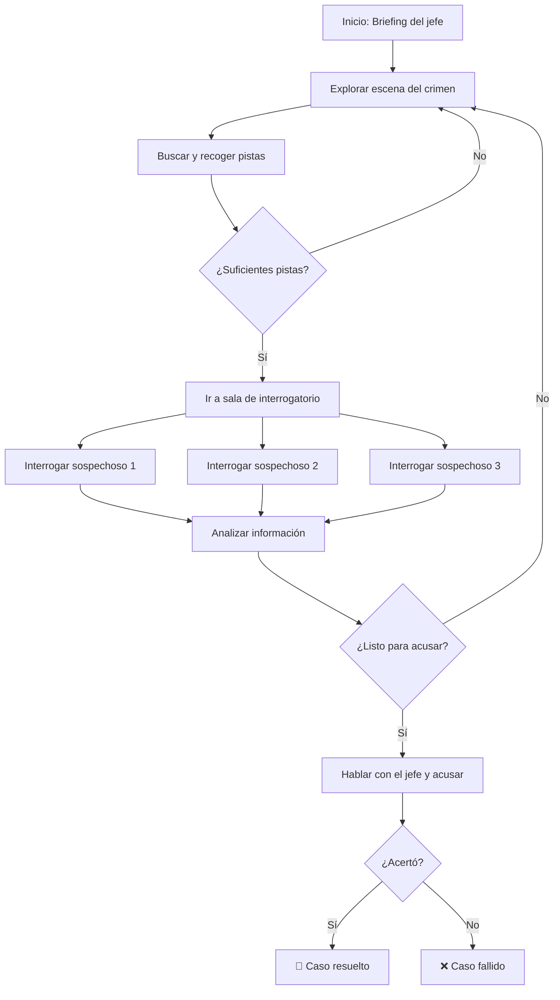

# 🎮 Game Design Document (GDD)
## "Detective Noir" — *Working Title*

> **Estado:** En revisión activa  
> **Versión:** 0.3  
> **Fecha:** 22 de abril de 2026  
> **Equipo:** 4 integrantes — Ignacio Cuevas, Martin Cevallos, Sofia Meza, Diego Espinosa  
> **Asignatura:** ICI5442 – Tecnologías Emergentes  
> **Motor:** Godot 4  
> **Plataforma:** PC (Windows / Linux)  
> **Nota de versión:** v0.3 — migración de Meta Quest 2 VR a PC desktop por feedback de profesores. Removido OpenXR/XR Tools. Sistema de interacción con pistas rediseñado (press-X). R3 rediseñado (encendedor de oro).

---

## 1. Visión General

### 1.1. Concepto del Juego
Un juego de detectives en primera persona para PC donde el jugador investiga un crimen. Debe explorar escenarios, recoger pistas e interrogar sospechosos controlados por un LLM con personalidades únicas, usando su propia voz (Speech-to-Text). El entorno general y la interfaz están en español, pero **todos los NPCs hablan en inglés**, y **el jugador está obligado a hablar en inglés** para interrogar. Un asistente de IA integrado escucha al jugador y, si se equivoca, salta para corregir los errores e indicarle cómo debió decirlo. El objetivo es descubrir al culpable y presentar tu caso al jefe.

### 1.2. Género
Noir / Detective / Misterio / Aventura narrativa

### 1.3. Plataforma
- **PC (Windows / Linux)** — teclado y mouse, o mando (controller)

### 1.4. Audiencia Objetivo
- Jugadores de PC interesados en narrativa, misterio e inmersión
- Personas que quieran practicar inglés en un contexto interactivo con retroalimentación en tiempo real

### 1.5. Propuesta de Valor Única (USP)
Un juego de detectives en PC donde el jugador realmente le habla a los sospechosos: cada interrogatorio es único gracias a IA conversacional (STT → LLM), los NPCs responden con texto y un balbuceo característico por personaje (estilo Animal Crossing), y el juego corrige tu inglés de forma natural mientras investigas.

### 1.6. Componente Educativo
La interfaz general (menús, inventario) y la voz del ayudante están en **español**, pero el contenido core del juego está en **inglés**. 
- Los NPCs hablan 100% en inglés.
- El jugador (mediante detección de voz) **debe** hablar e interrogar en inglés.
- **Mecánica de corrección:** El ayudante LLM analiza lo que el jugador acaba de decir (Speech-to-Text). Si el jugador comete un error gramatical o de pronunciación grave, el ayudante interviene de inmediato y le dice (en español) en qué se equivocó y cómo debió decir la frase correctamente.

---

## 2. Gameplay

### 2.1. Core Loop (Bucle Principal)
```
Explorar escenario → Encontrar pistas → Interrogar sospechosos (voz) → Formular hipótesis → Acusar ante el jefe
```

### 2.2. Mecánicas Principales

| Mecánica | Descripción | Prioridad |
|----------|------------|-----------|
| Exploración 3D | Moverse por el escenario en primera persona con WASD/mouse o joystick | 🔴 Alta |
| Inspección de pistas (press-X) | Acercarse a un objeto → prompt "Presiona X" → modo inspección → pasa al inventario | 🔴 Alta |
| Testimonios como evidencia | Durante diálogo con NPC, al decir una línea clave aparece prompt "¿Agregar como evidencia? [X]" | 🔴 Alta |
| Interrogatorio por voz | Hablar con NPCs usando micrófono (PTT); el NPC responde en **texto** vía LLM acompañado de balbuceo característico | 🔴 Alta |
| Menú contextual en NPCs | Presionar X cerca de un NPC despliega: Interrogar / Examinar | 🔴 Alta |
| Inventario de pistas | Sistema para revisar pistas físicas y testimonios recolectados (tecla Tab) | 🟡 Media |
| Acusación final | Presentar hasta 3 pruebas a Commissioner Papolicia en árbol de diálogo y nombrar al culpable | 🔴 Alta |
| Asistente de inglés | Gajito evalúa el inglés del jugador (STT) y corrige errores en español vía pop-up | 🟡 Media |

### 2.3. Controles PC

| Acción | Teclado / Mouse | Mando (Controller) |
|--------|----------------|-------------------|
| Moverse | WASD | Joystick izquierdo |
| Girar vista | Mouse | Joystick derecho |
| Interactuar / Inspeccionar (press-X) | E | Botón X (Xbox) / Cuadrado (PS) |
| Menú contextual NPC | E (cerca de NPC) | X cerca de NPC |
| Hablar (PTT — push to talk) | Mantener V | Mantener LB / L1 |
| Abrir inventario de pistas | Tab | Botón Select / View |
| Sprint | Shift | L3 (joystick izq. presionado) |
| Pausa | Escape | Start / Menu |

### 2.4. Flujo de una Partida


---

## 3. Narrativa

> **Referencia completa:** `design/narrative/cast-bible.md` (personajes) y `design/narrative/world-rules.md` (reglas del universo)

### 3.1. Ambientación
Ciudad ficticia estadounidense de estilo años 50 — noches lluviosas, jazz, neones, humo de palillo de canela. El mundo está habitado **íntegramente por frutas y verduras antropomórficas** (no hay humanos). El caso transcurre en el interior del club nocturno **"El Agave y La Luna"**, durante la noche de su gala anual. Neón verde aceituna, olor a naranja confitada, un piano en el escenario y un cadáver en la oficina del dueño.

### 3.2. Historia del Caso: *"La Última Nota en El Agave y La Luna"*

**La víctima:** Cornelius "Corn" Maize (61 años), mazorca de maíz, dueño del club. Hallado muerto de un disparo en su oficina del piso de arriba durante la gala anual.

**La verdad:** Bartholomew "Barry" Peel (plátano, 34 años) mató a Corn. El padre de Barry lo declaró públicamente indigno del apellido antes de morir y puso el fideicomiso familiar bajo control de Cornelius. Durante tres años, Barry tuvo que pedirle permiso a Corn para acceder a su propia herencia mientras era humillado en privado. Esa noche, Barry descubrió que el acuerdo de "liberación" que Corn le presentó era una trampa — cederle el 40% de la empresa bananera. Subió al piso de arriba, confrontó a Corn, y cuando Corn se negó, lo disparó. **Móvil: duelo e identidad, no codicia.** Barry mató para firmar su propio nombre por primera vez.

**Eco narrativo del clímax:** Al inicio Barry le dice a Gajito: *"My father always said: a man who can't sign his own name isn't a man at all. Tonight I finally understand what he meant."* Al final, confrontado con las pruebas: *"I signed mine tonight. Just not on paper."* Limonchero reconoce que lo supo desde el principio — eligió seguir el proceso de todas formas porque acusar sin pruebas no es justicia.

---

### 3.3. Personajes

#### El Jugador — Limonchero
| Campo | Valor |
|-------|-------|
| Fruta | Limón amarillo grande |
| Trasfondo | El mejor detective de Latinoamérica. Ex-jefe del escuadrón de agentes en cubierto más grande de LATAM. |
| Motivación | Ambición legítima: busca nuevos retos. EE.UU. es el siguiente nivel. |
| Idioma | No habla inglés — se comunica en español con Gajito |

---

#### NPC Asistente: Gajito
| Campo | Valor |
|-------|-------|
| Fruta | Limón de pica (key lime) — más pequeño, más ácido |
| Rol | Traductor oficial asignado. Asistente de apoyo al jugador. |
| Función | Sugiere cómo formular preguntas, aclara respuestas de NPCs, da contexto cultural. El jugador habla directamente en inglés — Gajito apoya, no reemplaza. |
| Idioma | Español (con Limonchero) / Inglés (con NPCs cuando traduce) |
| Personalidad | Energético, hiperpreparado, habla de más cuando está nervioso. Admira a Limonchero y lo encuentra imposible en partes iguales. |
| Prompt base LLM | `Eres Gajito, asistente oficial del detective Limonchero. Hablas con él en ESPAÑOL. Cuando el jugador comete un error gramatical en inglés, lo corriges de forma irónica pero constructiva. También puedes sugerir cómo formular preguntas a los NPCs y dar contexto sobre el caso. Nunca reveles al culpable directamente.` |

---

#### NPC Autoridad: Commissioner Wallace Papolicia
| Campo | Valor |
|-------|-------|
| Fruta | Papa (patata) |
| Rol | **Tutor del inicio** + autoridad del caso. Entrega la primera evidencia (Informe Preliminar del NFPD), enseña la mecánica de clasificar pistas, y luego vuelve a su rol de presión del reloj. Recibe la acusación final y evalúa si es correcta. |
| Personalidad | Impaciente, condescendiente. Ya tiene un sospechoso en mente (Gerry). Quiere cerrar el caso antes de medianoche. En el tutorial inicial es ligeramente más paciente — entrega el informe y se aparta. |
| Idioma | Solo inglés |
| Frase de tutorial | *"Detective. Crime scene's upstairs, door locked from inside, window cracked open. Here — preliminary report, everything we got. Four suspects, all still in the building. My money's on the bouncer, but that's your problem now. Midnight. Clock's ticking."* |
| Prompt base LLM | `You are Commissioner Papolicia. You speak ONLY IN ENGLISH. You are impatient and condescending. You want a quick arrest. If presented with a suspect and evidence, you accept. If no suspect by midnight, you arrest Gerry yourself. In the opening tutorial scene only, you are slightly more patient — you hand over the preliminary report and walk away without coaching.` |

---

#### Sospechoso 1: Moni Graná Fert — La Cantante (Femme Fatale)
| Campo | Valor |
|-------|-------|
| Fruta | Granada |
| Nombre | Moni Graná Fert, 29 años |
| Relación con la víctima | Cantante principal. Corn la tenía chantajeada con su pasado (orden de búsqueda por legítima defensa). |
| Personalidad | Femme Fatale. Magnética, no cálida. Desvía preguntas difíciles con coqueteo y preguntas personales al detective. El encanto no se siente como manipulación — se siente como atención. |
| Lo que oculta | Planeaba escapar esa noche — maleta escondida en la cocina. Su reacción al saber de la muerte fue alivio, lo cual la hace parecer culpable. |
| ¿Es culpable? | **No** |
| Coartada | Camerino 9:45–10:30 PM. Verificable, con hueco de ~20 minutos. |
| Prompt LLM | `You are Moni Graná Fert. You speak ONLY IN ENGLISH. You are a femme fatale — magnetic, composed, seductive. You deflect hard questions with flirtation and personal questions back at the detective. You deny any conflict with Cornelius — "Corn and I had an understanding." If asked about the 20-minute gap, let the silence sit, then say softly: "A girl needs air sometimes, detective." If the detective mentions the kitchen or a dark coat, you tense briefly before recovering with a slow smile.` |

---

#### Sospechoso 2: Gerald "Gerry" Broccolini — La Seguridad
| Campo | Valor |
|-------|-------|
| Fruta | Brócoli |
| Nombre | Gerald "Gerry" Broccolini, 44 años |
| Relación con la víctima | Seguridad del club, 5 años trabajando para Corn. |
| Personalidad | Monosilábico. No miente — omite. |
| Lo que oculta | Abandonó su puesto 22 minutos para encontrarse con su hermana (en protección de testigos). Sabe que alguien pudo entrar por la puerta trasera. |
| ¿Es culpable? | **No** |
| Coartada | "Fui al baño." Sin verificación. |
| Prompt LLM | `You are Gerry Broccolini. You speak ONLY IN ENGLISH. Answer in one or two words when possible. You say you were in the bathroom. If asked directly whether someone could have entered the back door while you were gone, pause, then say: "Maybe." You will not explain why you were gone.` |

---

#### Sospechoso 3: Dolores "Lola" Persimmon — La Contadora
| Campo | Valor |
|-------|-------|
| Fruta | Caqui |
| Nombre | Dolores "Lola" Persimmon, 51 años |
| Relación con la víctima | Contadora del club, 8 años. Conoce cada irregularidad contable de Corn. |
| Personalidad | Cooperativa en exceso — responde todo con detalle, lo cual es en sí mismo sospechoso. |
| Lo que oculta | Desviaba fondos para financiar una demanda civil contra Corn. Esa noche quemó los documentos en el baño al enterarse de la muerte. |
| ¿Es culpable? | **No** |
| Coartada | Oficina contable 9:45–10:47 PM. Hueco de 28 minutos entre 9:47 y 10:12 PM. |
| Prompt LLM | `You are Lola Persimmon. You speak ONLY IN ENGLISH. You are helpful and detailed. You account for your evening precisely except for 9:47–10:12 PM, where you say you "stepped away briefly." Do not mention the documents or the lawsuit. If pressed about financial records, redirect calmly: "Everything is in order."` |

---

#### Sospechoso 4: Bartholomew "Barry" Peel *(culpable)*
| Campo | Valor |
|-------|-------|
| Fruta | Plátano |
| Nombre | Bartholomew "Barry" Peel, 34 años |
| Relación con la víctima | Corn administraba su fideicomiso familiar y lo humillaba desde hacía 3 años. |
| Personalidad | Serenidad absoluta. Piel amarilla y lisa. Manchas oscuras en las manos que aparecen gradualmente. |
| Lo que oculta | Subió al piso de arriba ~22:00, confrontó a Corn, lo disparó cuando Corn se negó a liberar el fideicomiso sin condiciones. |
| ¿Es culpable? | **Sí** |
| Coartada | Afirma haber estado en su reservado toda la noche. |
| Condición de confesión | Solo confiesa con las tres pruebas simultáneas: acuerdo del fideicomiso (rasgado) + llave maestra + evidencia de pólvora en muñeca. |
| Prompt LLM | `You are Barry Peel. You speak ONLY IN ENGLISH. You are calm, well-dressed, and polite. You describe your relationship with Cornelius as "business." You deny being upstairs. You only crack if presented simultaneously with the trust document, the master key, and evidence of gunpowder residue.` |

---

### 3.4. Listado de Pistas

> Las pistas se dividen en **reales** (relevantes para resolver el caso) y **distractores** (objetos sospechosos pero sin relación con el crimen). El jugador debe discernir cuáles importan.

#### Pistas Reales

| # | Pista | Ubicación | Relevancia | Conecta con |
|---|-------|-----------|-----------|-------------|
| R1 | **El Acuerdo del Fideicomiso** — Documento rasgado y re-doblado que Barry debía firmar esa noche. Ceder el 40% de su empresa era una trampa | Reservado privado de Barry | 🔴 Alta | Barry (móvil) |
| R2 | **La Llave Maestra** — Llave del piso de arriba encontrada en el bolsillo interior del saco de Barry | Guardarropa Zona 1, saco #14 (press-X en saco) | 🔴 Alta | Barry (acceso a la oficina) |
| R3 | **El Encendedor de Oro** — Encendedor dorado hallado en el suelo de la oficina de Cornelius. Solo Moni lo reconoce como de Barry: *"That's Barry's lighter. He lit my cigarette with it at the start of the evening — I'd know it anywhere."* | Zona 5 suelo (press-X) + confirmado por Moni en diálogo (prompt "¿Agregar como evidencia? [X]") | 🔴 Alta | Barry (lo ubica en la escena del crimen) |
| R4 | **El Testimonio de Moni** — Vio a alguien "con traje amarillo" subir las escaleras hacia el piso de arriba ~22:00 | Camerino / conversación con Moni (prompt "¿Agregar como evidencia? [X]") | 🔴 Alta | Barry (lo ubica en el piso de arriba) |
| R5 | **La Puerta Trasera** — Gerry abandonó su puesto 22 minutos. Alguien pudo entrar sin ser visto | Puerta trasera / testimonio de Gerry (prompt "¿Agregar como evidencia? [X]") | 🟡 Media | Ruta alternativa de acceso |
| R6 | **Los Documentos Quemados** — Ceniza en el baño de empleados. Lola quemó algo esa noche | Baño de empleados | 🟡 Media | Lola (actividad sospechosa, pero no el crimen) |

#### Distractores

| # | Distractor | Ubicación | Por qué confunde |
|---|-----------|-----------|-----------------|
| D1 | **La Maleta de Moni** — Maleta escondida en la cocina. Planeaba escapar esa noche | Cocina del club | Moni tenía motivos para actuar, pero no mató a nadie |
| D2 | **El Abrigo Oscuro** — Moni lo usó al salir de la cocina. Varias personas lo vieron y lo confunden con una figura sospechosa | Perchero de la cocina | Confunde la identidad del sospechoso |
| D3 | **Las Irregularidades Contables** — Registros que muestran desvíos de fondos por parte de Lola | Oficina contable | Expone el fraude de Lola, pero no tiene relación con el crimen |
| D4 | **El Historial de Gerry** — Rumores de que trabajó para gente peligrosa antes del club | Conversación con otros NPCs | Gerry parece peligroso, pero protegía a su hermana |
| D5 | **Copa con huellas no identificadas** — Copa de bourbon a medio tomar en el reservado de Barry | Reservado privado | Las huellas son de Barry, pero sin contexto parecen de un invitado anónimo |

---

## 4. Diseño de Niveles / Escenarios

> **Nivel único:** Todo el juego transcurre en el club nocturno **"El Agave y La Luna"**. El escenario es uno solo, con varias zonas navegables de forma libre dentro del club.

### 4.1. Mapa General del Club "El Agave y La Luna"
```
                    [ ENTRADA / VESTÍBULO ]
                         |        |
                   [fuente]   [guardarropa]
                         |
              [ SALÓN PRINCIPAL ]
            /          |           \
    [escenario]    [pista baile]   [barra]
                         |
              [ PASILLO INTERIOR ]
            /                       \
  [baños / camerino]        [ ALA DE OFICINAS ]
                                    |
                         [ OFICINA DE CORNELIUS ]  ← escena del crimen
                                    |
                         [ PASILLO DE SERVICIO ]  ← ruta de Barry
                                    |
                         [ ALMACÉN / BODEGA ]
```

### 4.2. Zonas del Escenario Único

#### Zona 1: Vestíbulo / Entrada
- **Propósito:** Zona de entrada, presenta el ambiente del club y la noche de la gala.
- **Elementos interactuables:** Guardarropa con lista de invitados (el nombre de Barry Peel marcado — llegó a las 9:15 PM). Espejo del guardarropa orienta al jugador hacia el salón.
- **NPCs presentes:** **Commissioner Wallace Papolicia** (cerca de la entrada, da el briefing tutorial, entrega el Informe Preliminar del NFPD, y recibe la acusación final).
- **Ambiente:** Lluvia en los ventanales, música jazz desde el salón, neón verde aceituna filtrándose por la puerta.

#### Zona 2: Salón Principal / Barra
- **Propósito:** Hub social. Todos los sospechosos son accesibles o localizables desde aquí.
- **Elementos interactuables:** Copas, ceniceros, barra de caoba (barman puede confirmar llegadas y consumos), reloj de pared art-deco (tiempo narrativo).
- **NPCs presentes:**
  - **Barry Peel** (reservado privado al fondo — copa de bourbon a medio tomar, acuerdo del fideicomiso boca abajo en la mesa; pronuncia su frase de apertura al inicio)
  - **Moni Graná Fert** (cerca del escenario o camerino adjunto)
  - **Lola Persimmon** (sentada en una mesa, cooperativa en exceso con cualquiera que se acerque)
  - **Gerry Broccolini** (de guardia cerca de la barra o la puerta trasera)
  - **Gajito** (junto al jugador en todo momento)

#### Zona 3: Almacén / Bodega
- **Propósito:** Zona trasera del club. Acceso al pasillo de servicio desde la parte trasera.
- **Elementos interactuables:** Cajas de botellas, silla plegable junto a la salida trasera (puesto de Gerry, vacío durante 22 minutos), **maleta de Moni** (escondida detrás de sacos de harina — pista D1, red herring).
- **NPCs presentes:** Ninguno con nombre. Personal de cocina en segundo plano (no interactivos).

#### Zona 4: Pasillo de Servicio
- **Propósito:** Ruta oculta que conecta el almacén con la escalera trasera hacia el piso de arriba. Ruta que usó Barry para subir y para bajar (via Zona 6).
- **Elementos interactuables:** Dos juegos de huellas en el polvo (ronda habitual de Gerry + zapatos de vestir de Barry). Colilla de palillo de canela junto a la escalera trasera.
- **NPCs presentes:** Ninguno. Solo el detective puede acceder (puerta entreabierta desde la bodega).

#### Zona 5: Oficina de Cornelius (Escena del Crimen)
- **Propósito:** Núcleo del misterio. Aquí yace el cadáver y están las pistas físicas clave.
- **Elementos interactuables:**
  - Cuerpo de Cornelius "Corn" Maize (inspeccionable)
  - Caja fuerte abierta (la combinación está escrita bajo el cajón del escritorio)
  - **Copia del acuerdo del fideicomiso** sobre el escritorio — firmado por Corn, línea de Barry en blanco (contextualiza el móvil)
  - Ventana lateral: abierta pero con pestillo girado a "cerrado" desde dentro (alguien conocía el mecanismo de moneda)
  - Lámpara de escritorio volcada (señal visual de alteración)
  - **Puerta secundaria** (conecta con la Zona 6 — cerrada con llave desde el lado de la oficina)
- **NPCs presentes:** Ninguno (zona acordonada).
- **Nota de ruta:** Barry entró por el pasillo de servicio (Zona 4) y salió por la puerta secundaria hacia la Zona 6, dejando la puerta principal de la oficina cerrada desde dentro.

#### Zona 6: Área de Interrogatorio (Sala de Reuniones del Club)
- **Propósito:** Sala donde el detective interroga formalmente a cada sospechoso. Anteriormente usada por Cornelius para acuerdos privados bajo presión.
- **Elementos:** Mesa centrada bajo lámpara, dos sillas, espejo lateral en la pared frente al NPC, bloc de notas con indentaciones del acuerdo del fideicomiso (cifras visibles con luz oblicua). **Puerta secundaria** que da al pasillo contiguo a la oficina de Cornelius — cerrada con llave desde el lado de la oficina; la marca de la llave es inspeccionable.
- **NPCs presentes:** El sospechoso que el jugador elija citar aquí.
- **Interacciones:** Hablar con el sospechoso (STT → LLM → texto en tablón diegético + balbuceo local).

---

## 5. Arquitectura Técnica

### 5.1. Diagrama de Arquitectura General
```
┌────────────────────────────────────────────────────────┐
│                    PC DEL JUGADOR                      │
│                                                        │
│  ┌─────────────────────┐   ┌────────┐  ┌───────────┐  │
│  │ Godot 4             │   │  Mic   │  │ Altavoces │  │
│  │ (Motor 3D, Desktop) │   │ (PTT)  │  │  / Auricu │  │
│  └──────────┬──────────┘   └───┬────┘  └─────▲─────┘  │
│             │ localhost        │             │         │
│  ┌──────────▼──────────────────▼─────────────┴──────┐  │
│  │         SERVIDOR LOCAL (Python + FastAPI)        │  │
│  │  ┌──────────┐    ┌──────────────┐  ┌──────────┐  │  │
│  │  │  Ollama  │    │faster-whisper│               │  │
│  │  │ llama3.2 │    │   (STT)      │  [sin TTS]    │  │
│  │  └──────────┘    └──────────────┘               │  │
│  └─────────────────────────────────────────────────┘  │
└────────────────────────────────────────────────────────┘
```

> **Nota:** Game y servidor corren en la misma máquina vía localhost. LLM: Ollama + llama3.2 para todas las fases (dev, pruebas de usuario, entrega final). Sin TTS — NPCs responden como texto + balbuceo local. Ver ADR-0002.

### 5.2. Stack Tecnológico

| Componente | Tecnología | Notas |
|------------|-----------|-------|
| Motor 3D | Godot 4 | Open-source, export nativo a Windows/Linux |
| PC Export | Windows / Linux Export Template (Godot) | Build desktop nativo |
| LLM | Ollama + llama3.2 (local) | Todas las fases — dev, pruebas, entrega. Sin costo, sin internet. Ver ADR-0002. |
| Speech-to-Text | faster-whisper (local) | Modelo `medium` o `large-v3` |
| Balbuceo NPC | Audio clips procedurales en Godot | Un clip corto por NPC; tono y velocidad únicos por personaje (estilo Animal Crossing/Sims) |
| Backend | Python + FastAPI | Servidor local, proxy entre Godot y IA |
| Comunicación | HTTP/WebSocket (localhost) | Godot ↔ Backend en misma máquina |
| Assets 3D | Godot Asset Library / Kenney.nl / itch.io | Estilo visual `[TODO: definir]` |
| Audio/Música | `[TODO]` | Jazz noir, ambiente oscuro |
| Control de versiones | Git + GitHub/GitLab | — |

### 5.3. Pipeline de Interrogatorio (Flujo Técnico)
```
1. Jugador mantiene V (teclado) / LB (mando) → se activa micrófono (PTT)
2. Audio capturado por AudioEffectCapture → enviado por localhost al servidor
3. Servidor: Audio → faster-whisper (STT) → texto del jugador
4. Texto + historial + System Prompt del NPC → Ollama/LLM
5. Respuesta del LLM (texto) → enviada de vuelta a Godot por localhost
6. Godot muestra el texto del NPC letra a letra en subtítulos HUD
7. (Simultáneo al paso 6) Godot reproduce el clip de balbuceo del NPC sincronizado con la velocidad del texto
8. (Paralelo) El mismo texto del jugador es evaluado por el LLM Asistente
9. Si hay errores gramaticales → Gajito interviene con corrección en español (pop-up esquina inf. izq.)
```

### 5.4. Estructura del Proyecto Godot
```
DetectiveNoir/
├── scenes/
│   ├── main_menu.tscn
│   └── el_agave_y_la_luna.tscn   # Escenario único: El Agave y La Luna
├── scripts/
│   ├── core/
│   │   ├── game_manager.gd      # Estado del juego, pistas, progreso (autoload)
│   │   └── scene_loader.gd      # Navegación entre escenas
│   ├── player/
│   │   ├── player_controller.gd # CharacterBody3D + Camera3D, WASD/mouse
│   │   └── interaction_system.gd# Detección proximidad (Area3D) + press-X
│   ├── npc/
│   │   ├── npc_controller.gd    # Lógica de NPC + comunicación con LLM
│   │   └── dialogue_history.gd  # Historial de conversación
│   ├── clues/
│   │   ├── clue_interactable.gd # Objeto pista interactuable (press-X → inventario)
│   │   └── inventory_system.gd  # Inventario de pistas (físicas + testimonios)
│   ├── ui/
│   │   ├── hud.gd               # Subtítulos, indicador PTT, pop-up Gajito
│   │   └── inspect_overlay.gd   # Modo inspección (SubViewport o overlay)
│   └── ai/
│       ├── llm_client.gd        # HTTP requests al backend FastAPI (localhost)
│       ├── voice_manager.gd     # AudioEffectCapture → WAV → servidor STT
│       └── english_assistant.gd # Asistente de aprendizaje de inglés
├── assets/
│   ├── models/                  # Modelos 3D (.glb/.gltf)
│   ├── materials/               # Materiales y shaders
│   ├── textures/                # Texturas
│   ├── audio/                   # SFX y música
│   └── fonts/                   # Fuentes
├── export_presets.cfg           # Configuración export Windows/Linux
└── builds/                      # Ejecutables PC
```

---

## 6. Arte y Estilo Visual

### 6.1. Dirección Artística
`[TODO: Definir estilo. Ej: "Low-poly estilizado con paleta oscura y neones", "Semi-realista con iluminación volumétrica"]`

### 6.2. Paleta de Colores
`[TODO: Ej: Negro #0a0a0a, Gris oscuro #2a2a2a, Ámbar #d4a017, Rojo burdeos #6b0f1a, Azul neón #00b4d8]`

### 6.3. Iluminación
`[TODO: Ej: "Claroscuro, luces de neón, sombras marcadas, lluvia en ventanas, lámparas de escritorio cálidas"]`

### 6.4. Referencias Visuales
`[TODO: Agregar imágenes o links. Ej: L.A. Noire, Blade Runner, Sin City, Disco Elysium]`

---

## 7. Audio

### 7.1. Música
`[TODO: Estilo musical. Ej: "Jazz noir instrumental, piano melancólico, saxofón, contrabajo"]`

### 7.2. Efectos de Sonido
`[TODO: Lista. Ej: pasos, lluvia, puertas chirriantes, sirenas lejanas, máquina de escribir, encendedor]`

### 7.3. Balbuceo de NPCs (estilo Animal Crossing / Los Sims)
Los NPCs no tienen voz sintetizada. Cada uno tiene un **clip de balbuceo corto** que se reproduce en bucle sincronizado con la velocidad de aparición del texto. El carácter del personaje se comunica por el tono, velocidad y timbre del balbuceo, no por palabras.

| NPC | Estilo de balbuceo | Tono | Velocidad |
|-----|-------------------|------|-----------|
| Commissioner Papolicia | Grave, seco, interrumpe frases | Bajo | Rápida, impaciente |
| Moni Graná Fert | Suave, cadencioso, pausas largas | Medio-alto | Lenta, deliberada |
| Gerald "Gerry" Broccolini | Monosilábico, gruñidos cortos | Muy bajo | Muy lenta |
| Dolores "Lola" Persimmon | Parlanchín, tono de secretaria eficiente | Medio | Rápida, nerviosa |
| Bartholomew "Barry" Peel | Sereno, claro, sin muletillas | Medio | Pausada, controlada |
| Gajito | Energético, saltarín, se acelera cuando está nervioso | Agudo | Variable |

---

## 8. UI/UX en PC

> **Filosofía rectora:** Diegética adaptada a PC. La pantalla es un portal al mundo noir — no un HUD flotante, sino una extensión de la identidad del detective. El jugador no mira menús: *investiga*. Los elementos funcionales imprescindibles van en HUD overlay minimalista; todo lo demás existe dentro del mundo del juego.

### 8.1. Principios de Diseño PC

1. **Diegético primero:** El notebook físico en mano es el inventario. Las pistas son fotos que el jugador sostiene. El reloj de pared marca el tiempo narrativo. Si un detective de los 50 no lo usaría, el jugador no lo ve.
2. **HUD overlay solo para lo esencial:** Subtítulos, indicador PTT, popup Gajito y prompt de interacción. Nada más. Sin barras de vida, sin minimapa, sin popups de logros.
3. **Contraste noir:** Texto blanco cálido (`#E8D5A3`) sobre fondos oscuros semi-transparentes. Tipografía monospace tipo máquina de escribir (*Special Elite*).
4. **Feedback explícito:** Cada acción tiene respuesta visual o textual inmediata. El jugador siempre sabe qué pasó.
5. **Accesibilidad:** FOV ajustable (70–110°), tamaño de subtítulos configurable, todos los indicadores críticos tienen respaldo de forma (no solo color) para daltonismo.
6. **Menús como umbral:** Los menús de sistema (pausa, settings) usan temperatura de color opuesta al mundo (`#D8DCE0` frío vs `#D4A030` ámbar) para señalar que el jugador está "fuera" de la investigación.

### 8.2. Capas de Interfaz

| Capa | Tipo | Anclaje | Ejemplos |
|------|------|---------|----------|
| **Diegética** | Existe en el mundo 3D | World-space, objeto 3D o SubViewport | Notebook de inventario, fotos de pistas, reloj de pared, tablón de diálogo en pared |
| **HUD Overlay** | CanvasLayer 2D sobre la vista | Screen-space, fijo en pantalla | Subtítulos dual-channel, indicador PTT, popup Gajito, prompt de interacción |
| **Sistema** | Menús fuera del gameplay | Screen-space, solo en pausa | Menú principal, pausa, settings, acusación, resolución del caso |

**Regla:** Los elementos de Sistema solo aparecen cuando el juego está pausado o en transición. Durante gameplay, todo es Diegético o HUD Overlay mínimo.

### 8.3. Elementos de UI

#### 8.3.1 Elementos Diegéticos

| Elemento | Tipo | Descripción |
|----------|------|-------------|
| **Notebook de inventario** | Diegético 3D (mano / Tab) | Libreta de cuero oscuro que el jugador sostiene al presionar Tab. Páginas amarillentas con pistas como fotos pegadas y notas manuscritas. Layout: columna izq. = hechos, columna der. = sospechas. Sellos BUENA/MALA en tinta. |
| **Fotos de pistas** | Diegético (inspección) | Cada pista física se representa como fotografía blanco y negro con borde blanco y código de evidencia al reverso. El jugador puede rotarlas con el mouse. |
| **Reloj de pared** | Diegético (mundo) | Reloj art deco en el salón principal. No muestra tiempo real — avanza en saltos narrativos al completar objetivos. Sin barra de progreso digital. |
| **Indicador de NPC** | Diegético (world-space) | Anillo hexagonal sutil (`#E8D5A3`) que aparece alrededor del NPC cuando está en rango de interacción (≤1.5m). Sin texto por defecto. |
| **Tablón de diálogo** | Diegético (pared) | SubViewport proyectado como textura en una superficie del mundo (pared de la sala de interrogatorio). Muestra la respuesta del NPC letra por letra con efecto typewriter. |

#### 8.3.2 Elementos HUD Overlay

| Elemento | Posición | Descripción |
|----------|----------|-------------|
| **Subtítulos dual-channel** | HUD inferior, 80% ancho centrado | Canal izquierdo: nombre del NPC en su color identidad + texto. Canal derecho: "[Tú]" en lightblue + tu frase. Efecto typewriter (0.03s/carácter). Fondo semi-transparente `#000000` 70%. |
| **Indicador PTT** | Esquina superior-izquierda | Ícono de micrófono (tres barras de audio) + texto de estado: "Grabando..." (ámbar pulsante `#D4A030`), "Gajito pensando..." (procesando), inactivo (`#4A4035` casi invisible). |
| **Prompt de interacción** | Centro-inferior | Texto contextual: "[E] Examinar", "[E] Interrogar", "[E] Recoger". Fuente monospace, color `#E8D5A3`. Solo visible en rango de interacción. |
| **Popup Gajito** | Esquina inferior-izquierda | Corrección gramatical en español. Fondo lime green `#7ABE30` semi-transparente. Auto-dismiss tras 5 segundos. Animación de entrada: fade in 0.2s. |
| **Notificación de inventario** | Centro-superior | "[pista] añadida al inventario". Aparece 1.5s al recoger una pista. Fade out automático. |
| **Anti-stall hint** | Centro-inferior (sobre subtítulos) | Si el jugador no adquiere evidencias por 4+ minutos, Gajito sugiere sutilmente dónde buscar. Prioridad: L1 (4min) > L2 (5min) > L3 (7min). |

#### 8.3.3 Elementos de Sistema (Menús)

| Elemento | Activación | Descripción |
|----------|------------|-------------|
| **Menú principal** | Inicio del juego | Título "LIMONCHERO 3D", campo para session_id, indicador de estado del backend (saludable/error), botón "Iniciar Investigación", botón "Salir". Fondo: arte conceptual del club. |
| **Menú de pausa** | ESC | Fondo del juego desaturado al 60% con desenfoque. Panel central de cuero oscuro `#1A1208` con opciones: Continuar, Revisar notas (abre notebook), Configuración, Salir al menú principal. Jazz al 15% volumen. |
| **Configuración** | Desde pausa | Slider FOV (70–110°), tamaño fuente subtítulos (12–24pt), volumen master/voice/ambiente, sensibilidad mouse. Persiste vía ConfigFile. |
| **Overlay de inspección** | E sobre pista en inventario | Objeto centrado en pantalla, fondo oscurecido. Nombre + descripción. Botones: "Añadir al inventario", "Cerrar" (ESC). Cursor liberado. |
| **Árbol de acusación** | Diálogo con Papolicia | Al presentar caso: checkboxes para seleccionar hasta 3 evidencias, campo de texto para nombre del acusado. Botón "Acusar". |
| **Pantalla de resolución** | Post-acusación | Caso resuelto (BUENA): sello verde, resumen del caso, session_id. Caso fallido: sello MALA, explicación. Botón "Volver al menú". |

### 8.4. Colores de Identidad por Personaje

| Personaje | Color de nombre | Hex |
|-----------|----------------|-----|
| Gajito | Verde lima | `#8BC34A` |
| Commissioner Papolicia | Marrón tierra | `#6B4423` |
| Moni Graná Fert | Granate | `#8B2332` |
| Gerry Broccolini | Verde oscuro | `#4A6B30` |
| Lola Persimmon | Naranja-marrón | `#C4703A` |
| Barry Peel | Amarillo frío | `#D4C840` |

### 8.5. Especificaciones Técnicas de UI

| Parámetro | Valor |
|-----------|-------|
| Fuente | *Special Elite* (monospace serif typewriter, OFL/Apache 2.0) |
| Tamaño base cuerpo | 16pt |
| Tamaño títulos | 24pt |
| Tamaño subtítulos por defecto | 14pt (configurable 12–24pt) |
| Velocidad typewriter | 0.03s por carácter |
| Fade in/out estándar | 0.2s |
| Auto-dismiss Gajito | 5s |
| Notificación inventario | 1.5s |
| Anti-stall L1 / L2 / L3 | 4 / 5 / 7 minutos sin adquirir evidencias |
| Slots de inventario | 8 (grid 4 columnas × 2 filas) |
| Capa CanvasLayer HUD | Layer 10 |
| Capa CanvasLayer Gajito | Layer 15 |
| Capa CanvasLayer Sistema | Layer 20 |

### 8.6. Lo que Está Prohibido en la UI

- Barras de vida, stamina o medidores de estado (no es un juego de acción)
- Minimapa (el club es un espacio contenido que se navega físicamente)
- Pop-ups de logros durante gameplay (rompen inmersión noir)
- Colores de alta saturación fuera del sistema de identidad
- Fuentes sans-serif redondeadas (incompatibles con estética noir-frutícola)
- Texto en pantalla completa que no sea diegético

### 8.7. Mockups
`[TODO: Insertar mockups de las vistas principales — ver docs/design/ux/ para especificaciones por pantalla]`

---

## 9. Requisitos del Sistema

### 9.1. Requisitos Funcionales

| ID | Requisito | Prioridad |
|----|-----------|-----------|
| RF-01 | El jugador puede navegar todas las zonas accesibles de "El Agave y La Luna" con WASD/mouse o joystick | 🔴 Alta |
| RF-02 | El jugador puede inspeccionar y recoger pistas físicas con press-X (E/X); los testimonios se recopilan vía prompt "¿Agregar como evidencia? [X]" durante el diálogo | 🔴 Alta |
| RF-03 | El jugador puede hablar con NPCs usando su voz (micrófono PC, PTT con tecla V o LB) | 🔴 Alta |
| RF-04 | Los NPCs responden en **inglés** con personalidad única vía LLM, mostrando el texto en subtítulos HUD | 🔴 Alta |
| RF-05 | El asistente Gajito evalúa el inglés del jugador (STT) y corrige errores gramaticales en español vía pop-up | 🔴 Alta |
| RF-06 | El jugador puede acusar a un sospechoso ante Commissioner Papolicia presentando hasta 3 pruebas en árbol de diálogo | 🔴 Alta |
| RF-07 | Existe un asistente LLM (Gajito) para ayuda con aprendizaje de inglés contextual | 🟡 Media |
| RF-08 | El jugador posee un inventario de pistas accesible con Tab, que distingue pistas físicas de testimonios | 🟡 Media |
| RF-09 | Se muestran subtítulos de la conversación en dos canales (NPC / jugador) | 🟡 Media |
| RF-10 | Al presionar E/X cerca de un NPC se despliega menú contextual: Interrogar / Examinar | 🔴 Alta |

### 9.2. Requisitos No Funcionales

| ID | Requisito | Métrica |
|----|-----------|---------|
| RNF-01 | El juego debe mantener mínimo 60 FPS en PC de especificación mínima (i5-8400 / GTX 1060 equiv., 8GB RAM, 1080p) | ≥ 60 FPS sostenidos |
| RNF-02 | La latencia STT + LLM debe ser aceptable (sin TTS — el balbuceo es local e instantáneo) | < 4s end-to-end (medido en localhost) |
| RNF-03 | El servidor AI (Python/FastAPI) corre en localhost en la misma máquina que el juego; el juego detecta si el servidor no está disponible y muestra error accionable al inicio | Detección en startup; no crash |
| RNF-04 | El STT debe reconocer **inglés** (con acento latino) con buena precisión | > 85% accuracy |
| RNF-05 | El juego debe incluir opción de FOV ajustable en el menú de opciones | Slider FOV 70–110° presente y funcional |
| RNF-06 | `[TODO]` | `[TODO]` |

---

## 10. Pruebas con Usuarios (Entregas 2 y 3)

### 10.1. Escenarios de Prueba
`[TODO: Definir 2-3 escenarios. Ej:]`
1. `[Explorar la escena del crimen y encontrar al menos 3 pistas]`
2. `[Interrogar a los 3 sospechosos y obtener información clave]`
3. `[Acusar al culpable correcto ante el jefe]`

### 10.2. Variables a Medir
| Variable | Instrumento | Momento |
|----------|------------|---------|
| Usabilidad | SUS (System Usability Scale) | Post-test |
| Inmersión / Experiencia | UEQ (User Experience Questionnaire) | Post-test |
| Motivación | IMI (Intrinsic Motivation Inventory) | Post-test |
| Emociones | AEQ o SAM | Pre y Post |
| Aceptación de tecnología | TAM (Technology Acceptance Model) | Post-test |
| `[Aprendizaje de inglés]` | `[TODO: Pre/post vocabulary test?]` | Pre y Post |

### 10.3. Cuestionarios
- **Pre-test:** `[TODO: Datos demográficos, experiencia previa con videojuegos, nivel de inglés, expectativas]`
- **Post-test:** `[TODO: SUS + IMI + preguntas abiertas sobre la experiencia]`

### 10.4. Protocolo de Prueba Piloto
`[TODO: Describir condiciones, duración estimada (~15-20 min), número de usuarios (5-8), equipo necesario (PC)]`

---

## 11. Cronograma Resumido

| Fase | Periodo | Hito Principal |
|------|---------|---------------|
| Fase 1 – Diseño + PoC | 7 abr – 27 abr 2026 | Entrega 1: Informe diseño + prototipo básico |
| Fase 2 – Desarrollo 70% | 28 abr – 1 jun 2026 | Entrega 2: Demo funcional + diseño pruebas |
| Fase 3 – Final + Validación | 2 jun – 29 jun 2026 | Entrega 3: Build PC final + resultados pruebas |

---

## 12. Riesgos y Mitigaciones

| Riesgo | Prob. | Impacto | Mitigación |
|--------|-------|---------|------------|
| Alta latencia LLM+STT (sin TTS) | Media | Alto | Ollama llama3.2 con num_predict:150; balbuceo local cubre espera; budget ≤8s LLM + ≤4s STT |
| Ollama lento en hardware débil | Baja | Medio | Probar en PC más lento del equipo; fallback gemma2:2b si llama3.2 supera 8s |
| Assets 3D de baja calidad | Baja | Medio | Usar packs del Asset Store, estilo low-poly cohesivo |
| `[TODO]` | `[TODO]` | `[TODO]` | `[TODO]` |

---

## 13. Apéndices

### A. System Prompts de NPCs
`[TODO: Documentar los prompts completos de cada NPC aquí. Ejemplo de estructura:]`

```
Eres [NOMBRE], [relación con la víctima]. 
Personalidad: [descripción].
Lo que sabes del crimen: [información].
Lo que NO debes revelar fácilmente: [secretos].
Reglas: Responde siempre en español. Sé coherente con tu personalidad. 
Si el detective te presiona con pruebas válidas, puedes ceder parcialmente.
Nunca admitas el crimen directamente a menos que [condición].
```

### B. Diagrama de Casos de Uso
`[TODO: Insertar diagrama UML]`

### C. Diagramas de Secuencia
`[TODO: Insertar diagramas de secuencia para: interrogatorio, recolección pistas, acusación]`

### D. Diagrama Entidad-Relación
`[TODO: Insertar diagrama ER]`

### E. Diagrama de Estados
`[TODO: Insertar diagrama de estados del flujo del caso]`

---

> 📝 **Nota:** Este es un documento vivo. Los campos `[TODO]` deben completarse progresivamente. Versionar con Git.
